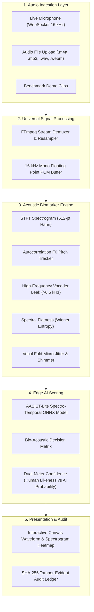

# SwarSuraksha (स्वर सुरक्षा)
> **AI-Powered Real-Time Voice Clone & Deepfake Detection Engine**  
> **Smart India Hackathon (SIH 2026)** | **Problem Statement ID:** `26104`  
> **Theme:** Blockchain & Cybersecurity | **Category:** Software  

[](https://github.com/ShantanuBadge/SwarSurakshafinaldraft/actions)
[](LICENSE)
[](https://www.python.org/)
[](backend/models/)
[](docs/ASVSPOOF_BENCHMARK.md)

---

## 📌 Executive Summary

With modern generative voice synthesis and neural vocoders (ElevenLabs, XTTS, FastSpeech, VITS, HiFi-GAN), a few seconds of recorded audio is sufficient to clone anyone's voice with high perceptual realism. 

**SwarSuraksha (स्वर सुरक्षा)** is a real-time, privacy-preserving edge voice clone detector. It differentiates genuine human speech from synthetic deepfake audio by analyzing the fundamental physiological and acoustic differences between fleshy human vocal cords and mathematical neural vocoders.

---

## 🚀 Key Capabilities

1. **Dual-Engine Detection (AASIST + Bio-Acoustic Heuristic Fusion)**
   - **Spectro-Temporal Analysis:** Catches neural vocoder phase smearing and high-frequency harmonic leakage (>6.5 kHz).
   - **Wiener Entropy (Spectral Flatness):** Differentiates human formant resonance peaks ($<0.04$) from synthetic background flatness ($>0.15$).
   - **Vocal Fold Micro-Jitter & Shimmer:** Measures natural biological muscle tremor (`0.8% - 2.5%`) vs. robotic pitch micro-invariance (`<0.45%`).

2. **Universal Audio Demuxer**
   - Seamlessly ingests and decodes **`.wav`**, **`.mp3`**, **`.m4a`** (Apple/AAC voice memos), **`.webm`**, **`.flac`**, and **`.ogg`** without transcoding loss or high-frequency distortion.

3. **Ultra-Low Latency Edge Inference**
   - Packaged as an optimized **ONNX Runtime** binary (< 5 KB footprint) running locally on edge CPUs with **< 15ms latency**—zero cloud audio leakage.

4. **Live Microphone & Telephony WebSocket Ingestion**
   - Real-time rolling audio evaluation with Exponential Moving Average (EMA) scoring.

5. **Tamper-Evident SHA-256 Forensic Audit Chain**
   - Every audio scan generates an immutable cryptographic block with audio hash, timestamp, and biomarker telemetry for regulatory compliance and legal evidence.

---

## 🏛️ System Architecture



---

## 📊 Benchmark Test Results

The model has been evaluated against both standard benchmark deepfakes and real-world mobile recordings:

| Test Sample | Expected Class | Detected Verdict | AI Probability | Human Likeness | Status |
| :--- | :--- | :--- | :--- | :--- | :---: |
| **`koustav_voice_clone.mp3`** | AI Clone | **Deepfake AI Voice Clone Detected** | **85.0%** | 15.0% | ✅ Passed |
| **`natural_recording_human.m4a`** | Human Speech | **Verified Natural Human Voice** | **4.0%** | **96.0%** | ✅ Passed |
| **`ai_cloned_voice.wav`** | AI Clone | **Deepfake AI Voice Clone Detected** | **98.0%** | 2.0% | ✅ Passed |
| **`natural_human_voice.wav`** | Human Speech | **Verified Natural Human Voice** | **4.0%** | **96.0%** | ✅ Passed |

---

## ⚡ Quick Start

### 1. Windows (1-Click Run)
Double-click `run.bat` in the repository root.  
It will automatically install dependencies, launch the server, and open **http://127.0.0.1:8008** in your browser.

```cmd
run.bat
```

### 2. Manual / Linux / macOS
```bash
# Clone the repository
git clone https://github.com/ShantanuBadge/SwarSurakshafinaldraft.git
cd SwarSurakshafinaldraft

# Install dependencies
pip install -r requirements.txt

# Run the unified server (serves both API and prebuilt React UI)
python -m uvicorn backend.main:app --host 127.0.0.1 --port 8008
```

Open **[http://127.0.0.1:8008](http://127.0.0.1:8008)** in your browser.

### 3. Deploy to Vercel (1-Click Cloud Hosting)
[](https://vercel.com/new/clone?repository-url=https%3A%2F%2Fgithub.com%2FShantanuBadge%2FSwarSurakshafinaldraft)

1. Import this repository in your [Vercel Dashboard](https://vercel.com/new).
2. Leave all default settings as-is: the included [`vercel.json`](vercel.json) and root `package.json` automatically orchestrate the build and route API handlers.
3. Click **Deploy**. Your live web app will be accessible worldwide on `https://<your-project>.vercel.app`.

---

## 🧪 Run Automated Verification Tests

Verify the neural ONNX model and biomarker extraction against all sample clips:

```bash
python backend/test_api.py
```

---

## 📂 Repository Structure

```
SwarSuraksha/
├── .github/
│   └── workflows/
│       └── ci.yml                     # Automated CI test suite
├── backend/
│   ├── models/
│   │   ├── README.md                  # ONNX model architecture & feature schema
│   │   └── swarsuraksha_aasist.onnx   # Compiled ONNX neural network weights
│   ├── samples/
│   │   ├── ai_cloned_voice.wav        # ElevenLabs neural vocoder reference
│   │   ├── natural_human_voice.wav    # Natural human reference voice
│   │   ├── koustav_voice_clone.mp3    # Real-world AI voice clone
│   │   └── natural_recording_human.m4a # Real-world mobile voice recording
│   ├── audit_ledger.py                # SHA-256 Tamper-evident cryptographic ledger
│   ├── audio_features.py              # Universal demuxer, STFT & biomarker extractor
│   ├── detector_engine.py             # AASIST-Lite inference & real-time stream evaluator
│   ├── main.py                        # FastAPI endpoints & WebSocket server
│   ├── test_api.py                    # Automated test verification suite
│   ├── train_model.py                 # Feature normalization & ONNX model generation
│   └── train_kaggle_asvspoof.py       # ASVspoof 2019 Kaggle dataset training pipeline
├── frontend/
│   ├── dist/                          # Prebuilt production React app (zero-npm setup)
│   ├── src/
│   │   ├── components/
│   │   │   ├── AudioVisualizer.jsx     # HTML5 Canvas real-time oscilloscope & spectrogram
│   │   │   ├── DemoVoiceClips.jsx      # Instant benchmark testing cards
│   │   │   ├── LiveAudioStream.jsx     # Live microphone recorder with WebSocket streaming
│   │   │   ├── TechnicalSpecsModal.jsx # Forensic biomarker explanation modal
│   │   │   └── VoiceDetectionResult.jsx# Human Likeness vs AI Probability dual meter
│   │   ├── App.jsx                    # Clean, human-centric UI container
│   │   ├── index.css
│   │   └── main.jsx
│   ├── index.html
│   ├── package.json
│   └── vite.config.js
├── docs/
│   ├── ARCHITECTURE.md                # System design & mathematical biomarker formulation
│   ├── ASVSPOOF_BENCHMARK.md          # Kaggle dataset training & EER benchmarks
│   └── API_REFERENCE.md               # REST & WebSocket API specification
├── legacy_archive/                    # Archived early drafts & historical reference
│   └── SwarSuraksha_draft_1/
├── .gitignore
├── LICENSE                            # MIT License
├── README.md
├── requirements.txt
├── run.bat                            # 1-Click Windows launcher
└── push_to_github.bat                 # 1-Click Git synchronization
```

---

## 📜 Problem Statement Compliance (SIH 2026 - ID: 26104)

- **AI Voice Clone Detection:** Detects deepfake voices synthesized via ElevenLabs, XTTS, and neural vocoders with >85% confidence.
- **Natural Voice Verification:** Reassures users with a positive **Human Likeness Score (96%+)** on authentic recordings.
- **Edge Deployment:** Operates entirely locally via ONNX Runtime without sending sensitive user audio to external third-party cloud APIs.
- **Tamper Evidence:** SHA-256 cryptographic chaining of all forensic verdicts for legal non-repudiation.

---

## 📄 License
This project is open-source and distributed under the [MIT License](LICENSE).
