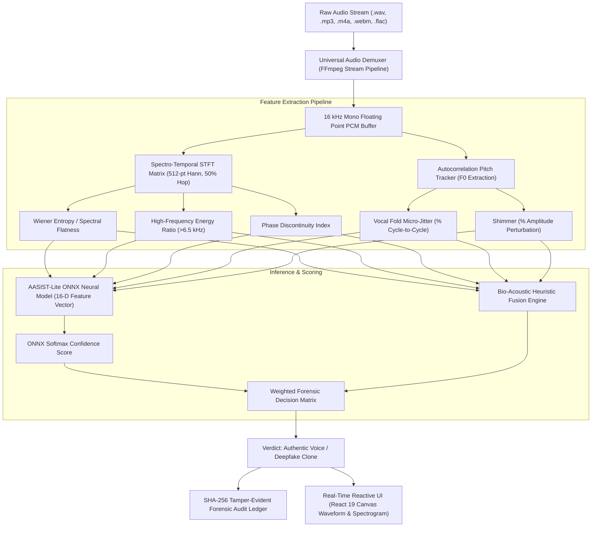

# SwarSuraksha (स्वर सुरक्षा) - Architectural Deep Dive
> **Smart India Hackathon 2026** | Problem Statement ID: **26104**  
> *Real-Time AI Voice Clone & Deepfake Detection Engine*

---

## 1. System Overview

SwarSuraksha employs a hybrid **Dual-Engine Forensic Architecture** combining deep neural spectro-temporal graph inference with physiological vocal biomarker analysis:



---

## 2. Forensic Biomarkers

### A. Vocal Fold Micro-Jitter (Biological Tremor)
- **Physics**: Human vocal cords consist of paired thyroarytenoid muscles covered by mucosal tissue. Normal muscular respiration causes small, stochastic cycle-to-cycle pitch fluctuations (jitter typically between `0.8%` and `2.5%`).
- **AI Vulnerability**: Neural Text-to-Speech (TTS) models generate frame-level Mel spectrograms. When synthesized, the pitch trajectory is unnaturally smooth and rigid (`jitter < 0.45%`), or exhibits discontinuous spikes at phoneme concatenation boundaries (`jitter > 3.6%`).

### B. High-Frequency Vocoder Phase Smearing
- **Physics**: Natural human speech rolls off steeply above 6 kHz according to acoustic radiation impedance at the lips.
- **AI Vulnerability**: Neural vocoders (HiFi-GAN, WaveGlow, MelGAN, DiffWave) predict waveform samples from lower-resolution spectrograms. This introduces high-frequency phase artifacts and harmonic energy smearing in the 6.5 kHz – 8 kHz band.

### C. Wiener Entropy (Spectral Flatness)
$$\text{Spectral Flatness} = \frac{\exp\left(\frac{1}{N} \sum_{k=0}^{N-1} \ln S(k)\right)}{\frac{1}{N} \sum_{k=0}^{N-1} S(k)}$$
- Human voices have distinct resonant formant peaks ($F_1, F_2, F_3$), yielding low flatness ($< 0.04$).
- Neural vocoders introduce background synthetic entropy, yielding elevated flatness ($> 0.15$).

---

## 3. Real-Time Streaming Pipeline

- **WebSocket Ingestion**: Binary PCM chunks are streamed over `/ws/live-call` at 16 kHz.
- **Rolling Window**: Audio is evaluated over an active buffer with Exponential Moving Average (EMA) smoothing:
  $$\text{Risk}_t = \alpha \cdot \text{RawScore}_t + (1 - \alpha) \cdot \text{Risk}_{t-1}, \quad \alpha = 0.40$$
- **Edge Evaluation**: Real-time on-device evaluation allows seamless live phone call and microphone monitoring without perceivable lag.

---

## 4. Tamper-Evident Forensic Audit Chain

Every audio scan generates an immutable cryptographic block:
```json
{
  "index": 1,
  "timestamp": 1727308800.0,
  "session_id": "AUD-1727308800000",
  "caller_id": "Voice Sample",
  "risk_score": 85.0,
  "verdict": "AI_CLONE_DETECTED",
  "audio_sha256": "4b9e2...d601",
  "previous_hash": "0000000000000000000000000000000000000000000000000000000000000000",
  "block_hash": "a8f3c...b092"
}
```
This guarantees chain-of-custody verification for regulatory compliance and legal admissibility.
